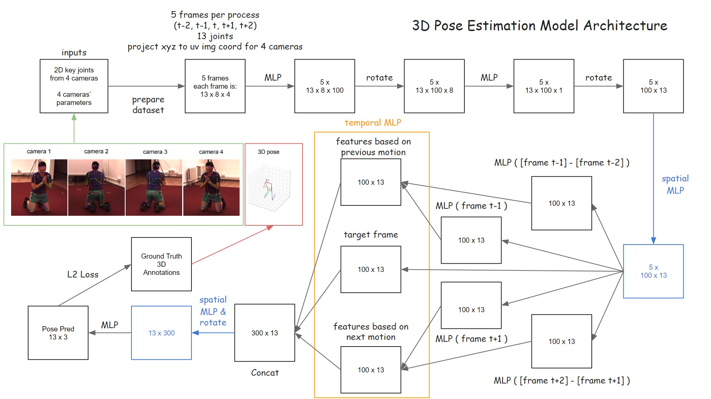

# 3D Pose Estimation
 
This project uses multi-view 2D cameras to predict human key joints in a 3D space. The procedure steps are:
 
1. pick five frames t-2, t-1, t, t+1, t+2 (there could be 15 frames or any arbitrary number of frame between t-1 and t)
2. use triangulation technique to generate rays through the key joints, then estimate the closest points between each pair of rays
3. use MLP to increase the dimentionality of the joints
4. use Attention mechenism to make the 19 key joints (based on the COCO annotation) to learn the relationships among each others
5. use key joints in t-2 and t-1 frames to predict joints' 3D locations for t frame, same apply to t+1 and t+2
6. concatenate the data from two pred frames with the data from the t frame, then use MLP to make the prediction

### Model Architecture
 

